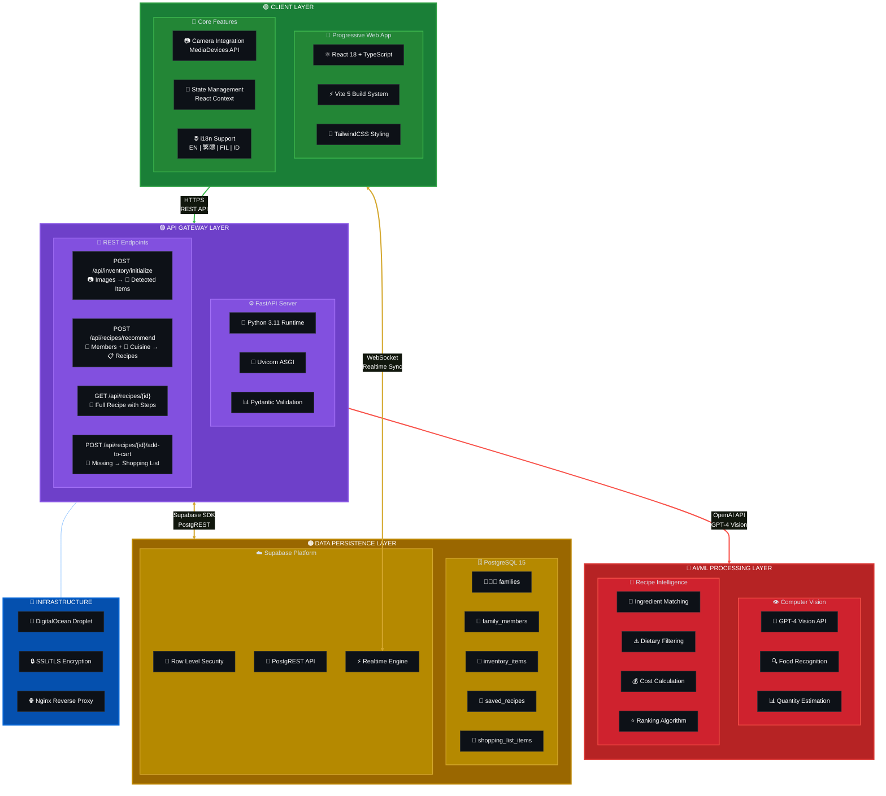

# Smart Fridge System Architecture

## Color Legend

| Color | Layer | Technologies |
|-------|-------|--------------|
| 🟢 Green | Client | React, TypeScript, Vite, TailwindCSS |
| 🟣 Purple | API | FastAPI, Python, Uvicorn, Pydantic |
| 🔴 Red | AI/ML | GPT-4 Vision, OpenAI API |
| 🟠 Orange | Database | PostgreSQL, Supabase |
| 🔵 Blue | Infrastructure | DigitalOcean, Nginx, SSL |

