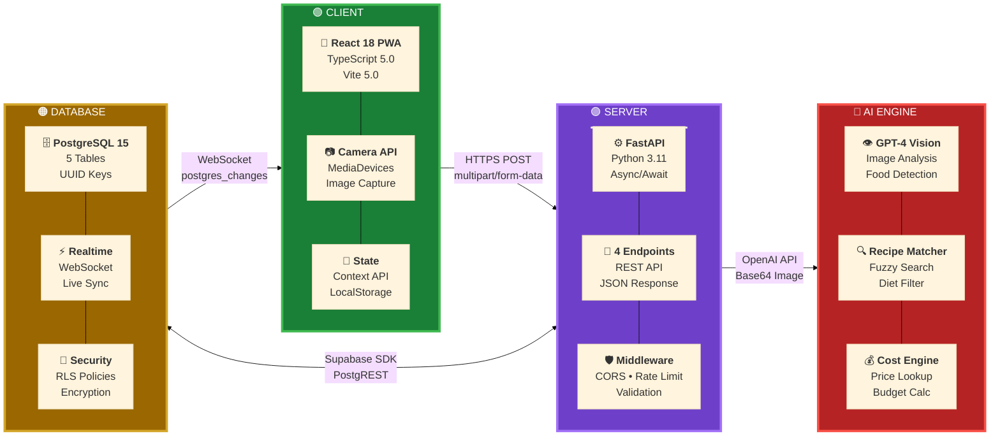
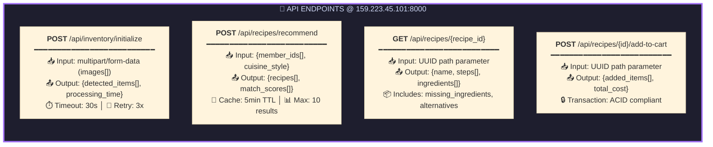
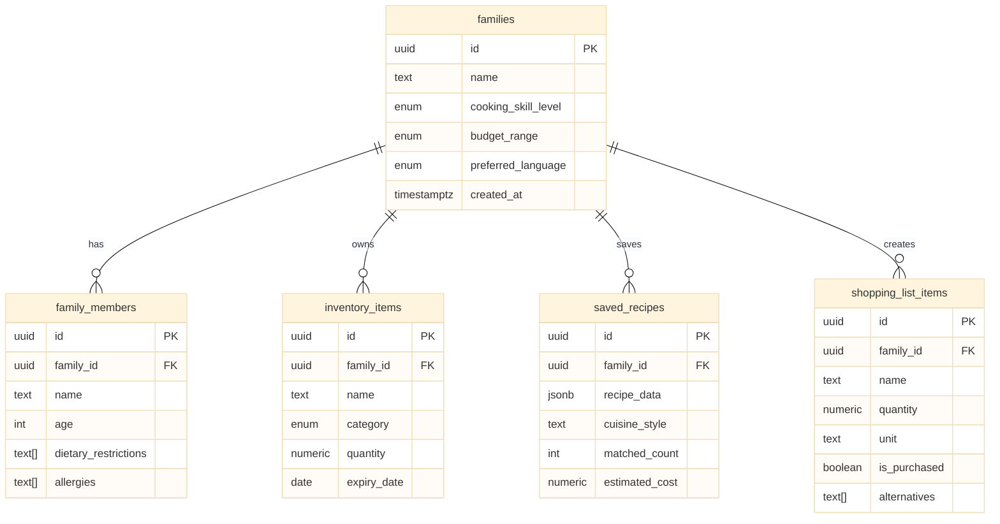

# Smart Fridge - Technical Architecture Overview

---

## API Specification

---

## Database Schema

---

## Tech Stack Summary

| Layer | Technology | Version | Purpose |
|-------|------------|---------|---------|
| **Frontend** | React | 18.2 | UI Components |
| | TypeScript | 5.0 | Type Safety |
| | Vite | 5.0 | Build Tool |
| | TailwindCSS | 3.4 | Styling |
| **Backend** | FastAPI | 0.100+ | REST API |
| | Python | 3.11 | Runtime |
| | Uvicorn | Latest | ASGI Server |
| | Pydantic | v2 | Validation |
| **AI/ML** | GPT-4 Vision | Latest | Image Recognition |
| | OpenAI SDK | Latest | API Client |
| **Database** | PostgreSQL | 15 | Primary DB |
| | Supabase | Latest | BaaS Platform |
| **Infra** | DigitalOcean | - | Cloud Hosting |
| | Nginx | Latest | Reverse Proxy |

