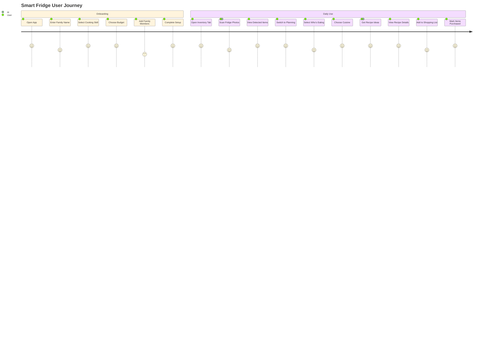
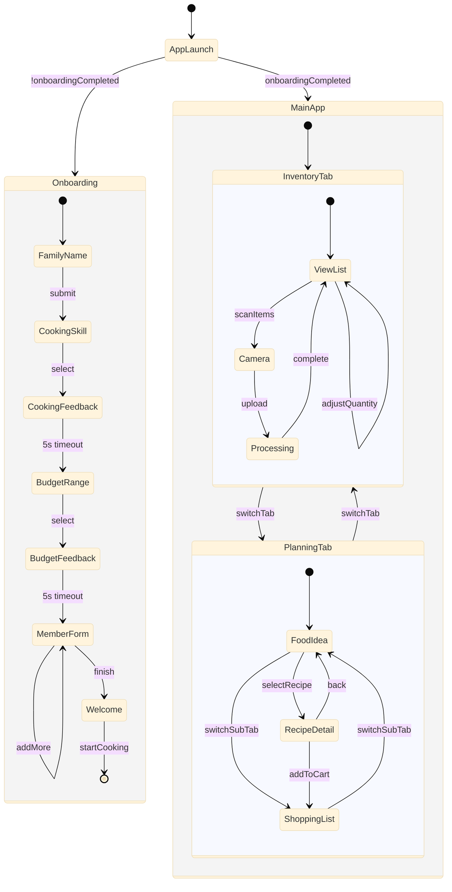

# Smart Fridge - Complete User Flow

```mermaid
%%{init: {'theme': 'base', 'themeVariables': { 'fontSize': '14px'}}}%%

flowchart TB
    subgraph LAUNCH["🚀 APP LAUNCH"]
        style LAUNCH fill:#1e1e2e,stroke:#f5c2e7,stroke-width:3px,color:#fff
        START(("🏠 Open App"))
        CHECK{"First Time<br/>User?"}
        START --> CHECK
    end

    subgraph ONBOARDING["✨ ONBOARDING FLOW │ First-Time Setup"]
        style ONBOARDING fill:#1e1e2e,stroke:#f5c2e7,stroke-width:3px,color:#fff
        direction TB
        
        O1["📝 <b>STEP 1: Family Name</b><br/>━━━━━━━━━━━━━━━━━━━<br/>• Typewriter welcome animation<br/>• Large input field (36px)<br/>• Animated placeholder examples<br/>• 'Get Started' button"]
        
        O2["👨‍🍳 <b>STEP 2: Cooking Skill</b><br/>━━━━━━━━━━━━━━━━━━━<br/>• 4 options: Rarely → Daily<br/>• Maps to: Beginner/Intermediate/Advanced<br/>• Selection triggers praise feedback<br/>• 5-second animated transition"]
        
        O3["💰 <b>STEP 3: Budget Range</b><br/>━━━━━━━━━━━━━━━━━━━<br/>• 3 tiers: Budget/Moderate/Premium<br/>• Shows HK$ ranges<br/>• Positive feedback animation<br/>• 5-second transition"]
        
        O4["👨‍👩‍👧‍👦 <b>STEP 4: Family Members</b><br/>━━━━━━━━━━━━━━━━━━━<br/>• Name + Age inputs<br/>• Dietary restrictions (6 options)<br/>• Allergies (6 options + custom)<br/>• 'Add More' or 'Finish'"]
        
        O5["🎉 <b>STEP 5: Welcome</b><br/>━━━━━━━━━━━━━━━━━━━<br/>• Celebration animation<br/>• Personalized greeting<br/>• Community stats<br/>• 'Start Cooking!' CTA"]
        
        O1 --> O2 --> O3 --> O4 --> O5
    end

    subgraph MAIN["📱 MAIN APPLICATION"]
        style MAIN fill:#1e1e2e,stroke:#89b4fa,stroke-width:3px,color:#fff
        
        TOPBAR["🔝 <b>TOP BAR</b><br/>Family Name │ Theme Toggle │ Language"]
        TABS["📑 <b>BOTTOM TABS</b><br/>[ Inventory ] │ [ Planning ]"]
    end

    subgraph INVENTORY["🥬 INVENTORY TAB"]
        style INVENTORY fill:#1e1e2e,stroke:#a6e3a1,stroke-width:3px,color:#fff
        direction TB
        
        I_CHECK{"Inventory<br/>Empty?"}
        
        I_EMPTY["📭 <b>EMPTY STATE</b><br/>━━━━━━━━━━━━━━━━━━━<br/>🍽️ Large icon with bounce<br/>'Your fridge is empty'<br/>'Tap scan button below'"]
        
        I_LIST["📦 <b>ITEM LIST</b><br/>━━━━━━━━━━━━━━━━━━━<br/>▼ Vegetables (collapsible)<br/>  • Carrot x3 [+][-]<br/>  • Broccoli x1 [+][-]<br/>▼ Fruits<br/>▼ Dairy<br/>▼ ... (12 categories)"]
        
        I_SCAN["📷 <b>CAMERA UPLOAD</b><br/>━━━━━━━━━━━━━━━━━━━<br/>• Live camera viewfinder<br/>• Multi-image support<br/>• Gallery picker option<br/>• Upload progress bar"]
        
        I_DETECT["🔍 <b>AI DETECTION</b><br/>━━━━━━━━━━━━━━━━━━━<br/>• GPT-4 Vision processing<br/>• Detected items list<br/>• Edit quantities<br/>• Confirm & add to inventory"]
        
        I_CHECK -->|"Yes"| I_EMPTY
        I_CHECK -->|"No"| I_LIST
        I_EMPTY --> I_SCAN
        I_LIST --> I_SCAN
        I_SCAN --> I_DETECT
        I_DETECT --> I_LIST
    end

    subgraph PLANNING["🍳 PLANNING TAB"]
        style PLANNING fill:#1e1e2e,stroke:#cba6f7,stroke-width:3px,color:#fff
        direction TB
        
        P_TABS["📑 <b>SUB-TABS</b><br/>[ Food Idea ] │ [ Shopping List ]"]
        
        subgraph FOOD_IDEA["💡 FOOD IDEA SECTION"]
            style FOOD_IDEA fill:#313244,stroke:#cba6f7,stroke-width:2px
            
            P_MEMBERS["👥 <b>WHO'S EATING?</b><br/>━━━━━━━━━━━━━━━━━━━<br/>Multi-select member chips<br/>Unselected: Border only<br/>Selected: Gradient fill + glow"]
            
            P_CUISINE["🍜 <b>CHOOSE CUISINE</b><br/>━━━━━━━━━━━━━━━━━━━<br/>Grid of cuisine options<br/>🍜 Chinese │ 🍝 Italian<br/>🍣 Japanese │ 🌮 Mexican<br/>🍛 Indian │ 🥘 Thai..."]
            
            P_SEARCH["🔍 <b>GET RECIPES</b><br/>━━━━━━━━━━━━━━━━━━━<br/>Disabled if no selection<br/>Loading: Typewriter effect<br/>'Finding perfect recipes...'"]
            
            P_RESULTS["📋 <b>RECIPE RESULTS</b><br/>━━━━━━━━━━━━━━━━━━━<br/>Recipe cards with:<br/>• Name + Share button<br/>• Match % progress bar<br/>• X/Y ingredients available<br/>• Estimated cost (HK$)"]
            
            P_MEMBERS --> P_CUISINE --> P_SEARCH --> P_RESULTS
        end
        
        subgraph RECIPE_DETAIL["📖 RECIPE DETAIL VIEW"]
            style RECIPE_DETAIL fill:#313244,stroke:#f9e2af,stroke-width:2px
            
            R_HEAD["← <b>BACK</b> │ Recipe Name"]
            
            R_TABS["[ Cooking Steps ] │ [ Ingredients ]"]
            
            R_STEPS["📝 <b>COOKING STEPS</b><br/>━━━━━━━━━━━━━━━━━━━<br/>Step 1: Cut chicken...<br/>Step 2: Heat oil...<br/>Step 3: Add sauce...<br/>(Numbered cards)"]
            
            R_INGS["🥗 <b>INGREDIENTS</b><br/>━━━━━━━━━━━━━━━━━━━<br/>✅ We Have (green section)<br/>  • Chicken, Garlic...<br/>❌ Need to Buy (red section)<br/>  • Soy Sauce, Peanuts..."]
            
            R_CART["🛒 <b>ADD TO CART</b><br/>━━━━━━━━━━━━━━━━━━━<br/>Full-width gradient button<br/>Disabled if nothing missing<br/>Hover: Lift + glow effect"]
            
            R_HEAD --> R_TABS
            R_TABS --> R_STEPS
            R_TABS --> R_INGS
            R_INGS --> R_CART
        end
        
        subgraph SHOPPING["🛒 SHOPPING LIST SECTION"]
            style SHOPPING fill:#313244,stroke:#94e2d5,stroke-width:2px
            
            S_EMPTY["📭 <b>EMPTY STATE</b><br/>🛒 'Your shopping list is empty'"]
            
            S_LIST["📋 <b>ITEM LIST</b><br/>━━━━━━━━━━━━━━━━━━━<br/>┌─────────────────────┐<br/>│ Soy Sauce           │<br/>│ 2 tbsp • HK$12  [Mark]│<br/>└─────────────────────┘<br/>┌─────────────────────┐<br/>│ ̶C̶h̶i̶c̶k̶e̶n̶ ̶(̶p̶u̶r̶c̶h̶a̶s̶e̶d̶)̶  │<br/>│ 500g • HK$35    [✓] │<br/>└─────────────────────┘"]
            
            S_SYNC["⚡ <b>REALTIME SYNC</b><br/>━━━━━━━━━━━━━━━━━━━<br/>WebSocket connection<br/>Auto-refresh on changes<br/>Multi-device support"]
        end
        
        P_TABS --> FOOD_IDEA
        P_TABS --> SHOPPING
        P_RESULTS --> RECIPE_DETAIL
        RECIPE_DETAIL --> SHOPPING
    end

    %% Navigation Flow
    CHECK -->|"Yes"| O1
    CHECK -->|"No"| MAIN
    O5 --> MAIN
    MAIN --> INVENTORY
    MAIN --> PLANNING

    %% Styling
    linkStyle 0,1,2 stroke:#f5c2e7,stroke-width:2px
    linkStyle 3,4,5,6,7 stroke:#f5c2e7,stroke-width:2px
```

---

## User Journey Summary

```mermaid
%%{init: {'theme': 'base'}}%%

journey
    title Smart Fridge User Journey
    section Onboarding
      Open App: 5: User
      Enter Family Name: 4: User
      Select Cooking Skill: 5: User
      Choose Budget: 5: User
      Add Family Members: 3: User
      Complete Setup: 5: User
    section Daily Use
      Open Inventory Tab: 5: User
      Scan Fridge Photos: 4: User, AI
      View Detected Items: 5: User
      Switch to Planning: 5: User
      Select Who's Eating: 4: User
      Choose Cuisine: 5: User
      Get Recipe Ideas: 5: User, AI
      View Recipe Details: 5: User
      Add to Shopping List: 4: User
      Mark Items Purchased: 5: User
```

---

## State Transitions

```mermaid
%%{init: {'theme': 'base'}}%%

stateDiagram-v2
    [*] --> AppLaunch
    
    AppLaunch --> Onboarding: !onboardingCompleted
    AppLaunch --> MainApp: onboardingCompleted
    
    state Onboarding {
        [*] --> FamilyName
        FamilyName --> CookingSkill: submit
        CookingSkill --> CookingFeedback: select
        CookingFeedback --> BudgetRange: 5s timeout
        BudgetRange --> BudgetFeedback: select
        BudgetFeedback --> MemberForm: 5s timeout
        MemberForm --> MemberForm: addMore
        MemberForm --> Welcome: finish
        Welcome --> [*]: startCooking
    }
    
    state MainApp {
        [*] --> InventoryTab
        
        InventoryTab --> PlanningTab: switchTab
        PlanningTab --> InventoryTab: switchTab
        
        state InventoryTab {
            [*] --> ViewList
            ViewList --> Camera: scanItems
            Camera --> Processing: upload
            Processing --> ViewList: complete
            ViewList --> ViewList: adjustQuantity
        }
        
        state PlanningTab {
            [*] --> FoodIdea
            FoodIdea --> ShoppingList: switchSubTab
            ShoppingList --> FoodIdea: switchSubTab
            
            FoodIdea --> RecipeDetail: selectRecipe
            RecipeDetail --> FoodIdea: back
            RecipeDetail --> ShoppingList: addToCart
        }
    }
```

